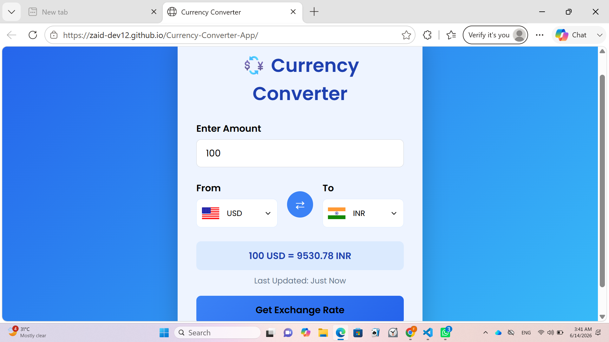

# Currency Converter

A simple and responsive Currency Converter built using HTML, CSS, and JavaScript.

## Features

- Convert currencies easily
- Responsive design
- User-friendly interface
- Fast and lightweight

## Technologies Used

- HTML
- CSS
- JavaScript

## Project Structure

- index.html
- style.css
- script.js

## Author

Zaid Farooqui

## Preview

## Live Demo

🔗 https://zaid-dev12.github.io/Currency-Converter-App/